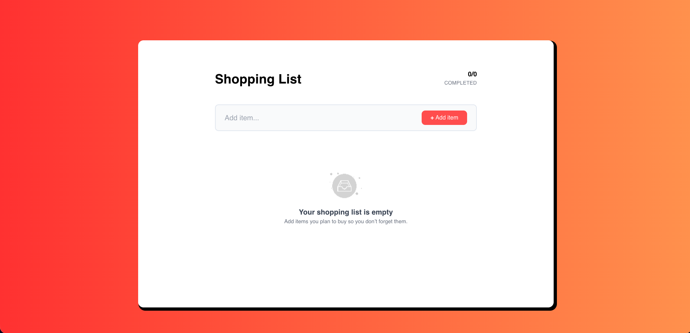
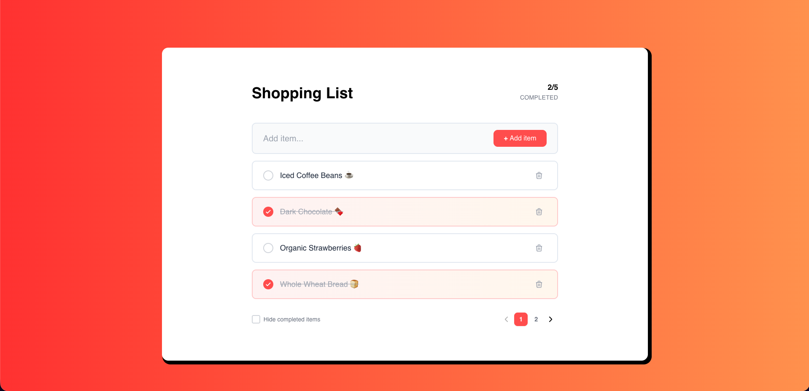
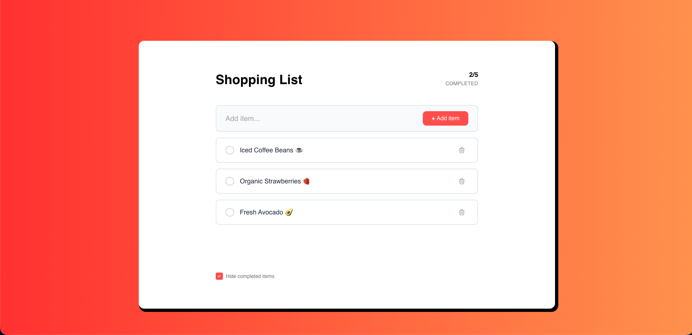
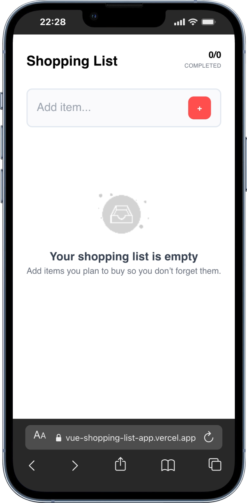
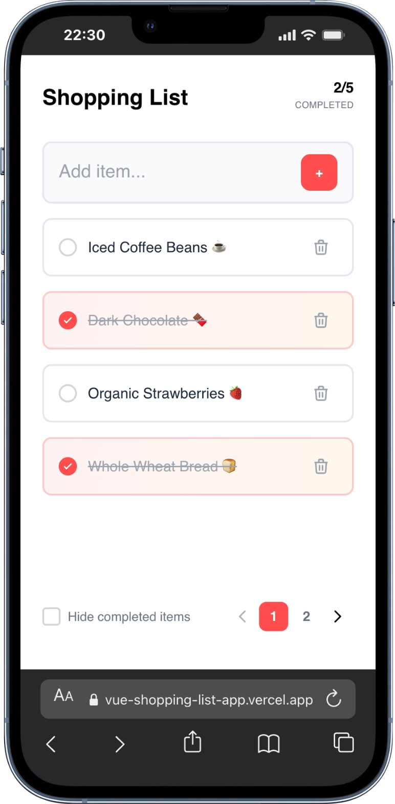

# 🛒 Modern Shopping List App

[](https://vuejs.org/)
[](https://tailwindcss.com/)
[](https://vitejs.dev/)
[](https://vercel.com/)

A sleek, responsive, and interactive Shopping List application built with **Vue 3 (Composition API)** and **Tailwind CSS**. This project focuses on high-quality UX, smooth animations, and clean code architecture.

🔗 **Live Demo:** [https://vue-shopping-list-app.vercel.app/](https://vue-shopping-list-app.vercel.app/)

---

## ✨ Features

- **Dynamic Item Management:** Add items that instantly appear at the top of the list for better visibility.
- **Custom Pagination:** Clean data presentation by limiting display to 4 items per page.
- **Smart Filtering:** A "Hide Completed" toggle to declutter your list and focus on pending tasks.
- **Premium UI/UX:**
  - Custom SVG Checkboxes with a vibrant **Red-to-Orange gradient** to match the brand identity.
  - Responsive design optimized for **Mobile, Tablet, and Desktop**.
  - Interactive hover states and polished typography.
- **Smooth Transitions:** Powered by Vue's `<TransitionGroup>` for fluid adding, removing, and filtering animations.

## 🧠 Challenges & Learnings

Building this app was a great journey in mastering Vue 3. Here are some key technical challenges I solved:

- **Event Bubbling Management:** Used the `.stop` event modifier on the delete button to prevent triggering the "complete" toggle of the parent card.
- **Complex List Transitions:** Implemented `absolute` positioning within `TransitionGroup` (using `.list-leave-active`) to ensure that remaining items slide up smoothly when one is deleted, preventing "jumpy" layout shifts.
- **Responsive State Handling:** Managed pagination logic to automatically redirect users back to Page 1 when filters are applied or items are added, ensuring no "empty page" states.
- **Advanced CSS Gradients:** Integrated custom hex-code gradients with Tailwind CSS to achieve a consistent 3D-effect UI across all components.

## 🚀 Installation & Setup

1.  **Clone the repository:**

    ```bash
    git clone [https://github.com/MaiBach22/Vue_shopping-list-app](https://github.com/MaiBach22/Vue_shopping-list-app)
    cd Vue_shopping-list-app
    ```

2.  **Install dependencies:**

    ```bash
    npm install
    ```

3.  **Run development server:**

    ```bash
    npm run dev
    ```

4.  **Build for production:**
    ```bash
    npm run build
    ```

---

## 📸 Preview

| Desktop Version |
| :-------------- |





| Mobile Version |
| :------------- |





---

Developed with ❤️ using Vue 3 and Tailwind CSS.
